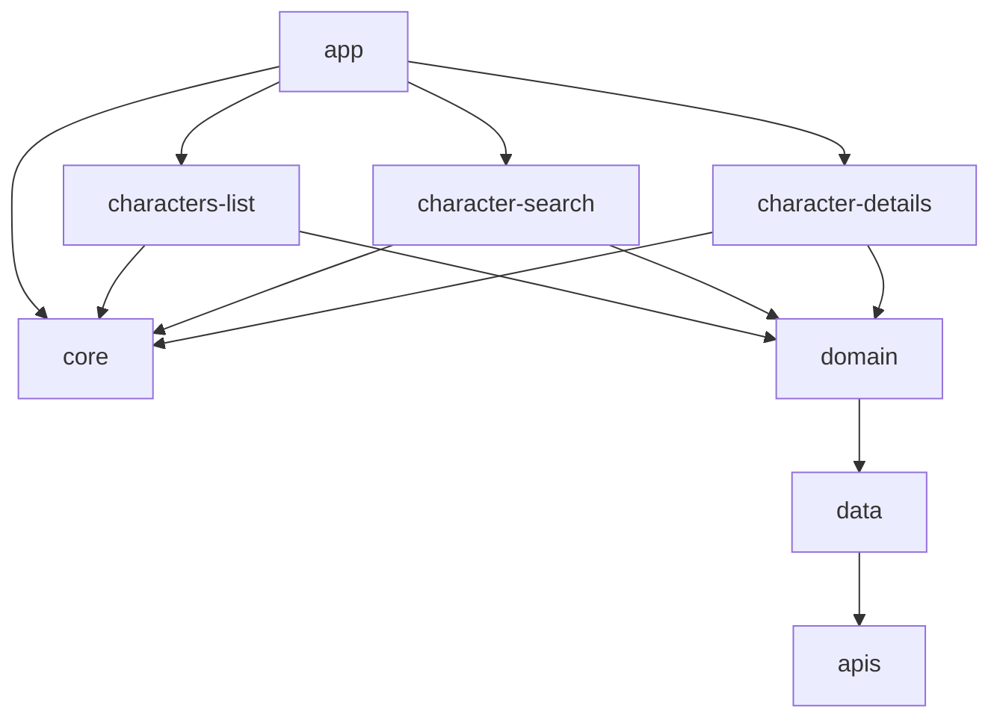

# HeroDex


A Compose/Material 3 Android app that lists a roster of original, fictional superheroes,
lets you search them by name, and shows each hero's detail with their comics. Built as a
portfolio piece to show a modular, testable, Clean Architecture Android app end to end.

> **Heads up:** this used to be a Marvel Comics API client. That API no longer exists, so the
> app now talks to its own tiny mock API instead — a static JSON file (see
> [`docs/api/heroes.json`](docs/api/heroes.json)) served for free via GitHub Pages, with a
> made-up cast of heroes. No API key, no account, no `local.properties` setup: clone it and run it.

The character list, search, and detail screens use Material 3 with dynamic color on Android 12+
and edge-to-edge content.

## Run it

```bash
git clone https://github.com/leinaro/herodex.git
cd herodex
./gradlew assembleDebug
```

That's it — no keys, no accounts. Open the project in Android Studio (Ladybug or newer) and hit
run, or install the APK from [GitHub Actions artifacts](../../actions) / a
[release](../../releases).

## Tech stack

- **UI:** Jetpack Compose, Material 3 (dynamic color, edge-to-edge), Navigation Compose
- **Architecture:** MVVM + Clean Architecture, modularized by layer and by feature
- **DI:** Hilt, with KSP (no kapt)
- **Async:** Kotlin Coroutines & Flow, Paging 3
- **Networking:** Retrofit + OkHttp + Gson, against a self-hosted static JSON API
- **Images:** Coil
- **Testing:** JUnit4, MockK, Turbine, Truth, Jacoco coverage gate
- **Build:** Gradle 8.11 Kotlin DSL, AGP 8.7, Kotlin 2.0 (K2), version-pinned convention
  plugins in `buildSrc`
- **CI:** GitHub Actions — lint, unit tests, and a debug APK on every push

## Architecture

This project follows:

- [Guide to app architecture](https://developer.android.com/topic/architecture)
- [Guide to Android app modularization](https://developer.android.com/topic/modularization)
- [Clean architecture](https://blog.cleancoder.com/uncle-bob/2012/08/13/the-clean-architecture.html)



### Modules

- [buildSrc module](buildSrc/README.md) — shared Gradle version/dependency/convention plugins
- presentation layer
  - [app module](app/README.md)
  - [core module](core/README.md) — shared Compose components, theme, base ViewModel
  - feature modules
    - [characters-list module](characters-list/README.md)
    - [character-search module](character-search/README.md)
    - [character-details module](character-details/README.md)
- domain layer
  - [domain module](domain/README.md)
- data layer
  - [data module](data/README.md) — owns the `Repository`, caches the roster fetched from `apis`
  - [apis module](apis) — Retrofit client for the mock API (`docs/api/heroes.json`)

## The mock API

[`docs/api/heroes.json`](docs/api/heroes.json) is a static array of heroes (with embedded comics),
served as-is by GitHub Pages once enabled on this repo (Settings → Pages → Deploy from branch →
`main` / `/docs`). The app fetches it once via Retrofit/OkHttp and does pagination and
name-filtering client-side in [`RepositoryImpl`](data/src/main/java/com/leinaro/data/RepositoryImpl.kt) —
real network code, zero backend to run or maintain.

Want to add your own heroes? Edit the JSON file, push, and the live app picks it up on next launch.

## Code coverage

Jacoco enforces an 80% minimum per module:

```bash
./gradlew :{module}:checkCoverage
```

```
$ ./gradlew :data:checkCoverage

COVERAGE PASSED ********
INSTRUCTION --> 93.07% expected: 80.0%
LINE ---------> 97.56% expected: 80.0%
METHOD -------> 90.91% expected: 80.0%
CLASS --------> 100.00% expected: 80.0%
************************
```

## About the developer

https://www.linkedin.com/in/ingenieraadela/
